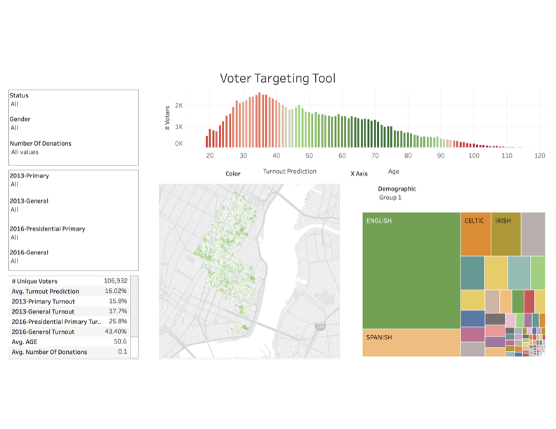
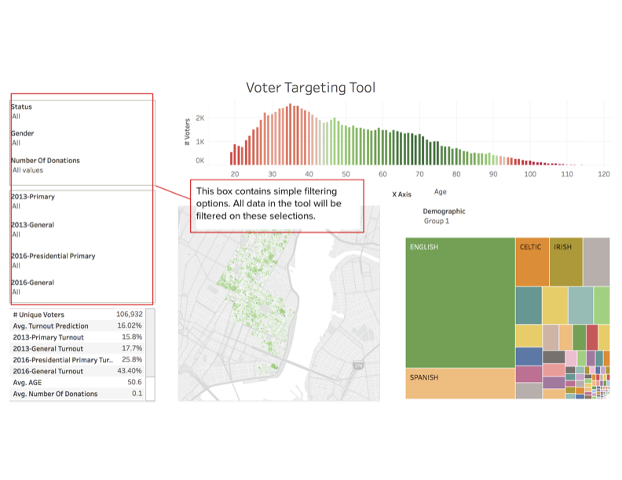
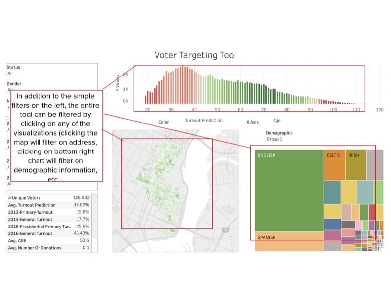
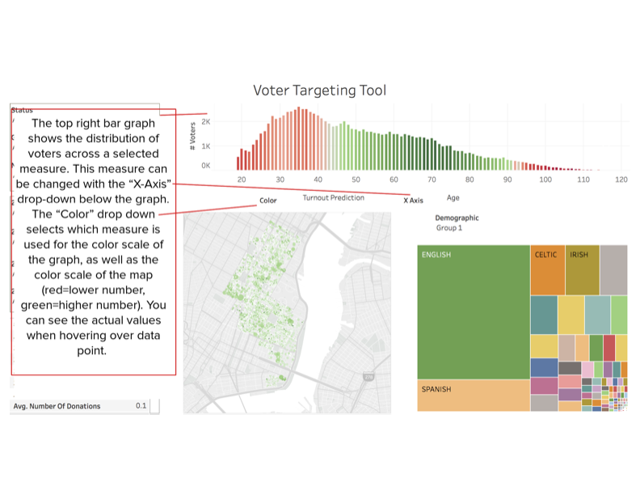
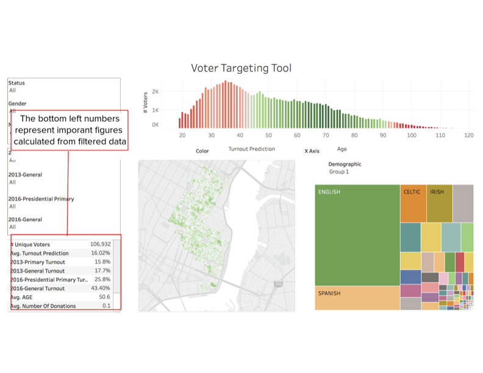
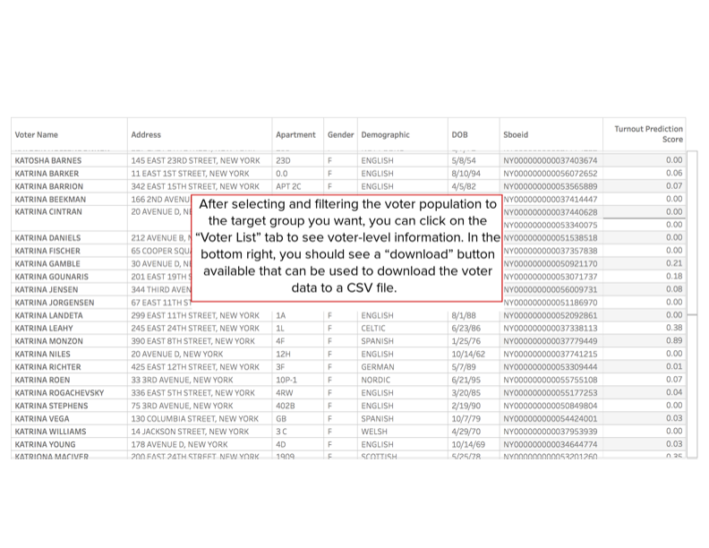

## My volunteer work for a local NYC political campaign

## Overview

A few years back, I volunteer to help a local NYC politician with the city council campaign. My idea? Build a tool: The Voter Data Analytics and Prediction Tool - a comprehensive data-driven system developed to enhance campaign strategies through detailed voter data analysis. This tool predicts voter turnout and preferences, analyzes demographics, clusters voters, and optimizes donor engagement, culminating in an interactive Tableau dashboard for intuitive analysis and decision-making by campaign staff.

*Note*: due to the sensitive nature of this work, the code and data are not publicly available.

## Tableau Dashboard

## Visualizations Section for README.md

### Visualization 1: Voter Turnout and Age Distribution

*Description:* This histogram displays voter turnout predictions against age demographics. The color gradient from red to green signifies lower to higher turnout predictions, offering a quick visual reference to identify age groups with varying predicted election participation levels.

### Visualization 2: Interactive Filtering Dashboard

*Description:* The dashboard provides interactive filters for status, gender, number of donations, and election years. Users can refine the data displayed across all visualizations, making the tool adaptable to specific campaign needs.

### Visualization 3: Voter List and Export Feature

*Description:* Here we see a detailed voter list with sortable columns for personalized targeting. The download feature allows campaign staff to export this data for further analysis or action.

### Visualization 4: Summary Statistics

*Description:* Key statistics such as average turnout predictions, age, and number of donations are calculated from the filtered dataset, providing actionable insights at a glance.

### Visualization 5: Voter Distribution by Turnout and Demographics

*Description:* The top-right bar graph correlates voter turnout with demographics, and the drop-down menus allow for dynamic changes in the displayed measure and color scales.

### Visualization 6: Comprehensive Filterable Dashboard

*Description:* This composite visualization emphasizes the tool's capacity for cross-filtering. Selections in one visual affect the others, offering an integrated approach to voter data analysis.

## Components

### 1. Voter Prediction Model
- **Objective:** Predict each voter's likelihood of participating in upcoming elections and their potential voting choices.
- **Methodology:** Employs a regression tree-based machine learning model, using voter history and previous election outcomes.

### 2. Demographic Model
- **Objective:** Classify and predict voter demographics for targeted outreach.
- **Data Sources:** NYC Board of Elections Voter Data, U.S. Census Data.

### 3. Donation Analysis
- **Objective:** Analyze donation patterns to strategically focus campaign efforts.
- **Data Sources:** NYCCFB Financial Disclosures, voter data.

### 4. Voter Clustering Model
- **Objective:** Segment voters into clusters based on significant data points using k-means clustering.
- **Application:** Customize voter outreach and campaign strategies for specific voter groups.

### 5. 311 Call Analysis
- **Objective:** Connect 311 call complaint types to voter data for issue-specific insights.
- **Integration:** Merges 311 call data with voter information to inform campaign messaging.

## Initial Proposal (.pptx)

- **Model Outputs**: Predictions and analyses are directly fed into the Tableau dashboard.
- **Interpreting Data**: Users can explore various aspects of voter data through interactive visualizations.
- **Decision Making**: The dashboard aids in identifying target voters and areas for outreach.
## Usage

- **Model Outputs**: Predictions and analyses are directly fed into the Tableau dashboard.
- **Interpreting Data**: Users can explore various aspects of voter data through interactive visualizations.
- **Decision Making**: The dashboard aids in identifying target voters and areas for outreach.

## Accuracy and Performance

- **Model Validation**: Rigorous testing ensures high accuracy, with performance metrics detailed in the appendix.
- **Customization**: Adjustable model parameters to align with specific campaign requirements.

## Requirements

- **Software**: Python 3.10, Data Science Libraries, Tableau Desktop or Server.
- **Data Access**: Permissions for public voter records and other datasets.

## Support and Contact

For support or inquiries related to the Voter Data Analytics and Prediction Tool, please reach out to tylerkline@gmail.com.

## Appendix (which you can find in the .pdf docs)

- **Model Accuracy**: Detailed performance and accuracy metrics of the models.
- **Technical Documentation**: In-depth documentation for developers and advanced users.
- **Update Log**: Chronological record of updates and enhancements to the tool.